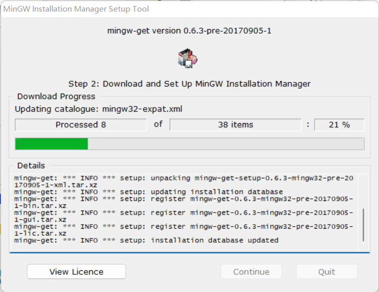
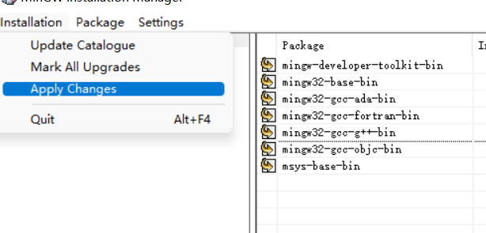
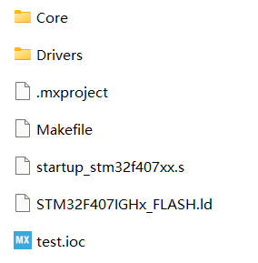
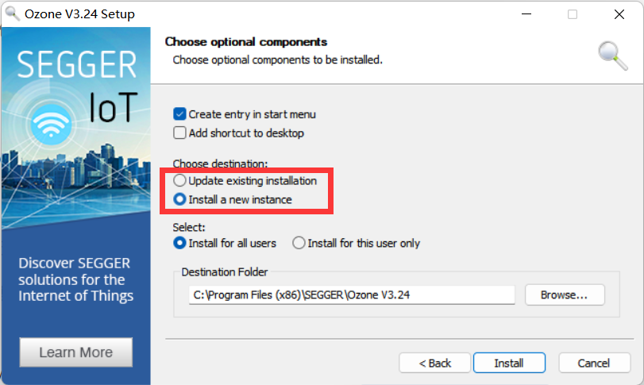
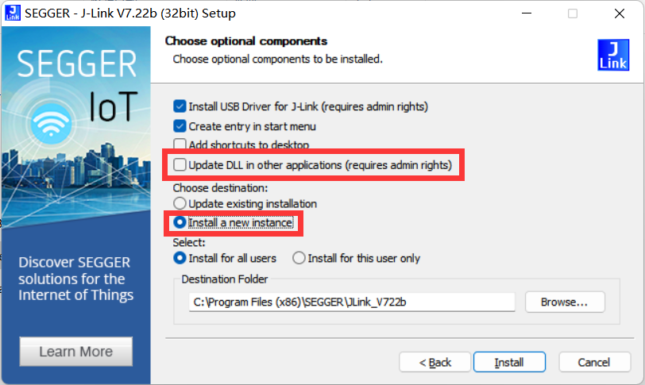
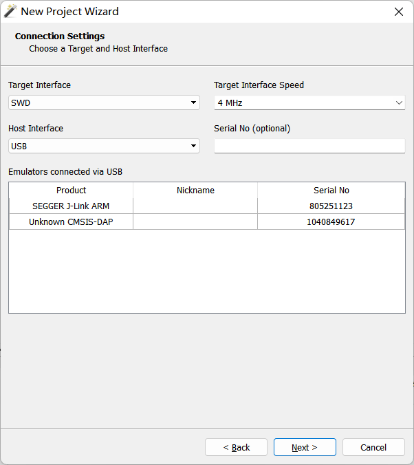

# 开发环境配置

<center><b><font face="楷体">brucelan1777@sjtu.edu.cn</font></b></center>

[TOC]

## 环境配置

- **软件安装**

本框架所用到的一些开发工具的下载方式，我们提供了网盘的资源。所有安装包也可以在交大网盘链接下获得：[archive.zip](https://pan.sjtu.edu.cn/web/share/103c2e95cbcf49e488d7fa8dc7d17e39)

```shell
# 网盘中的文件:
daplink_register_license.rar # daplink license注册机
arm-gnu-toolchain-13.3.rel1-mingw-w64-i686-arm-none-eabi.exe # arm-gnu-toolchain安装包。
JLink_x64.dll # 修改过的jlink运行链接库
JLink_Windows_V722b.exe  # JLink软件包
mingw-get-setup.exe  # mingw工具链（更推荐的方式是使用msys2安装）
OpenOCD.zip  # OpenOCD
Ozone_doc.pdf  # Ozone使用手册
Ozone_Windows_V326f_x64.exe  # Ozone安装包
# 如果你喜欢clang，可以使用clang下的arm工具链。
```

- 安装STM32CubeMX，并安装F4支持包和DSP库支持包


- 安装MinGW，等待界面如下：（will be deprecated soon，请注意这种方法将会在主分支发布正式版的时候删除）

  

  安装好后，打开MinGW后将所有的支持包勾选，然后安装：

  

  

  安装完以后，将MinGW的bin文件夹添加到环境变量中的path下，按下菜单键搜索**编辑系统环境变量**打开之后：

  

  图片看不清请打开原图。验证安装：

  打开命令行（win+R，cmd，回车），输入`gcc -v`，如果没有报错，并输出了一堆路径和参数说明安装成功。

  安装完之后，建议将ming的bin文件夹下的mingw32-make.exe复制一份，并将copy更名为make.exe

  > 当然，更推荐的方式是将MinGW终端集成到VSCode中，防止类linux环境和Win的环境冲突，特别是你的电脑中安装了其他工具链的时候，如MSVC、LLVM等。

- 配置gcc-arm-none-eabi环境变量，**把压缩包解压以后放在某个地方**，然后同上，将工具链的bin添加到PATH：（will be deprecated soon，请注意这种方法将会在主分支发布正式版的时候删除）

  

  <center>安装路径可能不一样，这里要使用你自己的路径而不是直接抄</center>

  验证安装：

  打开命令行，输入`arm-none-eabi-gcc -v`，如果没有报错，并输出了一堆路径和参数说明安装成功。

> 添加到环境变量PATH的意思是，当一些程序需要某些依赖或者要打开某些程序时，系统会自动前往PATH下寻找对应项。**一般需要重启使环境变量生效。**

**若你不希望扰乱系统的环境变量，可以参照附录5将Msys2/MinGW64的终端集成到VSCode中方便开发**。

- **将OpenOCD解压到一个文件夹里**，稍后需要在VSCode的插件中设置这个路径。（will be deprecated soon，请注意这种方法将会在主分支发布正式版的时候删除）

- **CubeMX生成代码**：

  在project manager标签页工具链选择makefile

  

  生成的目录结构如下：

  

  Makefile就是我们要使用的构建规则文件。

  > **如果你使用basic_framework，不需要重新生成代码。**

- **建议将ozone和jlink的目录一同加入环境变量，方便我们后续的一键下载和一键调试配置**


## Ozone可视化调试和LOG功能

> ~~Ozone暂时只支持jlink。~~
>
> 22/11/16**重要更新**：安装Ozone3.24 32-bit和J-Link7.22b目前可以支持Jlink和**dap-link（包括ATK无线调试器）**

### 软件安装

安装Ozone和J-link工具箱（驱动、gdb以及各种调试工具）。安装包都在网盘里。

应该先安装Ozone，再安装jlink。以下为步骤：

1. 安装Ozone

   

   这一步注意选择install a new instance（安装一个新的实例）。后续一路确认即可。

2. 安装jlink

   

   这一步注意不要勾选update dll in other application，否则jlink会把ozone里面老的驱动和启动项替代掉。choose destination和ozone一样，选择install a new instance。如果安装了老的相同版本的jlink，请先卸载（版本相同不用管，直接新装一个）。

3. **替换动态链接库**

   **将网盘上下载的`JLink_x64.dll`放到JLink和Ozone的安装目录下，替换原来的库。下载下来的库经过修改，使得J-LinkOB在使用的时候不会报“The JLink is defective"和”you are using a clone version“的错误。**

   **之后如果安装其他版本的jlink，也请注意*==不要勾选==*update DLL in other application，否则会替换掉修改过的动态链接库。**

### 配置调试项目

安装好两个软件之后，打开ozone后会显示一个new project wizard，如果没有打开，在工具栏的File-> New -> New project wizard。


选择M4内核，为了能够查看外设寄存器的值还需要svd文件。所有mcu的svd都在图中的文件夹里提供，当然你也可以使用我们仓库根目录下的文件。



接口选择swd，接口速度不需要太高，如果调试的时候需要观察大量的变量并且使用日志功能，可以调高这个值。如果连接了jlikn，上面的窗口中会显示。如果链接了dap-link，比如无线调试器，会出现Unknown CMSIS-dap。选择你要使用的调试器，然后继续。


选择构建之后生成的.elf文件（在项目文件夹下的build中）。这是调试器专用的文件格式，对其内容感兴趣可以自行搜索细节。此外ozone还支持.bin .hex .axf（最后一个是amr-cc，也就是keil的工具链会生成的）等格式。


这页不要动。如果希望保存jlink的调试日志，最后一个选项选择一个文件或者新建一个日志文件。

### 启用FreeRTOS支持

注意，如果你的代码使用了实时系统，在载入项目的时候Ozone会进行对应的提示。选择载入支持实时系统的插件即可。

如果没有提示，请在console中输入下面的命令然后回车即可：

```shell
Project.SetOSPlugin(“plugin_name”)
# plugin_name是启用的实时系统支持插件名
# 我们要使用的命令是Project.SetOSPlugin ("FreeRTOSPlugin_CM4")
```

支持的插件在Ozone的安装目录下的`Plugins/OS`目录：


我们的项目是F4的板子，内核时Cortex-M4（CM4），因此选用`FreeRTOSPlugin_CM4.js`（输入的时候js后缀不用输）。 ozone默认输入的命令似乎有误，需要手动修改（这好像和ozone的版本有关，请留意）

### 常用调试窗口和功能

下图的配置是笔者常用的layout。每个窗口是否显示、放在什么位置等都是可以自己定义的。通过工具栏的view选项卡可以自行选择需要展示的窗口。


1. 调试控制：和vscode类似

2. 变量watch窗口，这里的变量不会实时更新，只有在暂停或遇到断点的时候才会更新。若希望实时查看，在这里右键选择需要动态查看的变量，选择Graph，他就会出现在**窗口8**的位置。

   如果不需要可视化查看变量变化的趋势，但是想不暂停查看变量的值，请右键点击变量，选择一个合适的refresh rate：

   

   如果是一个结构体，你可以为整个结构体都进行刷新率的配置，不需要手动一个个修改。**或直接右键点击窗口**，将refresh打勾：

   

3. 断点和运行追踪管理

4. 调试控制台，输出调试器的信息。

5. 终端，支持一些jlink script的命令。**单片机通过log模块发送的日志也会显示在这里。**

6. 代码窗口，用于添加断点、添加查看等。鼠标悬停在变量上可以快速查看变量值和类型。希望打开整个项目文件，点击工具栏的view选项卡，单击Source Files就可以打开一个项目中所有源文件的窗口。右键点击函数或变量可以跳转到定义和声明、查看汇编代码等。按**F12**跳转到定义。

7. **变量可视化窗口，这就是Ozone的大杀器。**在变量添加到查看（watch）之后，右键点击watch中的变量选择Graph，变量会被添加到可视化查看中。你可以选择“示波器”的显示时间步长以及颜色等信息，还可以更改采样率。

   **注意，如果添加到动态调试窗口中没有反应，请在窗口8中修改一下”Sample Freq“为100Hz或200Hz即可**。

8. 窗口8和7配合。在窗口8中会实时显示变量值，并且统计平均值和最大最小值，**而且还会将所有采样值保存到一个csv文件当中**，如果需要进一步分析可以导出这个数据文件。若要进行系统辨识、前馈设计等，这无疑是最好的方法。这还可以方便我们观察采样值的异常，进一步提升debug的效率。

9. 内存视图。可以直接查看任意内存位置的值。

> 再次注意，这些窗口是否开启以及位置都是可以自定义的。
>
> **另外，如果使用dap-link，调试过程中可能会反复提示没有license，请查阅[附录1](##附录1：为daplink添加license)获取解决方案。**

如果在调试过程中发现bug或者需要更改代码，不需要终止调试或者关闭窗口。直接前往vscode修改并重新编译，Ozone会自动检测到.elf文件的变化，询问你是否重新加载项目。选择是后会自动开始下载并进入调试。

- **变量动态查看（可视化）**

    - **在变量的watch窗口右键点击变量，选择一个refresh rate也可以实时查看变量（和keil一样）。**

    - 如果没有打开窗口，现在view->timeline中打开可视化窗口。动态变量查看的窗口也在view->data sampling。

      启用动态变量查看的流程如下：

      ```mermaid
      graph LR
      在代码窗口中选中需要观察的变量 --> 添加到watch窗口 --> 在watch选择要动态查看的变量 --> 添加到Datasample窗口
      ```

      第一步的快捷键是`ctrl+w`，选中变量之后按。

      第二部的快捷键是`ctrl+g`，选中watch中的变量后按。

      第三步可以修改示波器的步长和采样频率。

    - 如果当前文件没有你要的变量，你想查看项目中的其他文件夹，在view-> source files中可以打开该项目所有的源文件，双击可以打开源文件。

      

- **日志打印**

在Terminal窗口查看，还可以通过命令直接控制单片机的运行（不过不常用）。

未打开窗口则在view-> terminal中打开。使用bsp_log打印的日志会输出到该窗口中.

- **外设查看**

在view-> register中打开窗口，选择Peripherals可以查看所有外设寄存器

CPU选项卡可以查看CPU的寄存器。

- **调用栈**

在view-> call stack中打开窗口。

### 常用快捷键

| 组合                 | 功能                                                 |
| -------------------- | ---------------------------------------------------- |
| ctrl+w               | 添加到查看                                           |
| ctrl+g               | 添加到动态查看（需要先添加到查看）                   |
| f12                  | 跳转到定义                                           |
| f5                   | 启动调试                                             |
| f10                  | 单步跳过                                             |
| f11                  | 单步进入                                             |
| shift+f11            | 单步跳出                                             |
| 右键+break on change | 当变量发生变化的时候进入此断点                       |
| ctrl+H               | 展示调用图，会列出该函数调用的所有函数（内部调用栈） |

如果你使用拥有多个按键的鼠标,推荐将侧键前设置为ctrl+点击以查看声明/定义,侧键后设置为添加到watch(debug),侧滚轮设置为前进后退(历史)

你还可以按ctrl+K ctrl+S进入快捷键设置页面,将tab设置为下一个提示,用enter接受intelliSense建议,这样不需要将手移出主键盘区域. 将ctrl+;设置为移动到行尾,同时打开c/c++的函数括号不全,这样不需要手动敲击括号.

将alt+k设置为左移,alt+l设置为右移,这样不需要方向键.

选择最适合自己的配置!

### 保存调试项目

退出时可以将调试项目保存在项目的根目录下，方便下次调试使用，不需要重新设置。可以为jlink和daplink分别保存一套调试配置。

## 附录1：为daplink添加license

在网盘上下载`daplink_register_license.rar`，解压出来之后打开。**请关闭杀毒软件。**


根据Ozone打开时提示的daplink的序列号，将其输入注册机，电机generate，就会生成5个license。

windows菜单搜索J-link license manager，点击添加license，将注册机生成的五个license依次复制黏贴并添加到的license manager中即可。


## 附录2：Windows修改用户名为英文

1. 右键【任务栏win徽标】->【计算机管理】->【本地用户和组】->【用户】->右键【中文用户名】->【重命名】

   > 如果是win10，则是：右键【计算机（一般放在桌面上，如果没有的话桌面右键选择个性化，然后打开桌面图标）】->【管理】->【本地用户和组】->【用户】->右键【中文用户名】->【重命名】

   **注意这个英文用户名后续还要使用**

2. **以管理员权限**启动命令提示符，输入

   ```shell
   net user administrator /active:yes
   ```

   如果杀毒软件提示恶意修改，请放行

3. 重启电脑，登录的时候选择**Administrator**账户，需要进行一些简单的设置，直接一路确定即可。

4. 进入C盘的用户文件夹下，把你原来的用户文件夹名称改成刚刚设定的英文用户名。

5. 【Windows+R】->【运行】->输入 regedit ->回车

   找到`HKEY_LOCAL_MACHINE\SOFTWARE\Microsoft\Windows NT\CurrentVersion\Profilelist`，把这个标签页下每个选项都点开看，其中有一个页面对应的`ProfileImagePath`值是以你用户名命名的文件夹路径，比如我的路径是`C:\User\小曾`。

   双击，把这个路径改成你新设的用户名，比如我的`C:\User\Neo`

6. 重启电脑，进入修改好的用户，

7. **以管理员权限**启动命令提示符，输入

   ```shell
   net user administrator /active:no
   ```

   如果杀毒软件提示恶意修改，请放行。这会关闭Administator账户。
